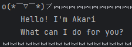

# Akari User Guide




A cheerful chatbot that helps you manage your tasks with style! Akari saves your tasks between sessions, so you never lose track of what’s important.

---

## Features

- **Add, list, mark, unmark, delete, and find tasks** with simple commands.
- **Three task types**: Todo, Deadline, Event (with date/time support).
- **Persistent storage**: Your tasks are saved automatically and reloaded when you return.
- **Search by task description or date**: Quickly find what you need.
- **Expressive feedback**: Akari responds with fun emoticons and clear messages.

---
## Quick Start

Launch Akari and type commands directly. Here’s what you can do:

| Command                                | Example                                                         | What it does                             |
|----------------------------------------|-----------------------------------------------------------------|------------------------------------------|
| `todo DESCRIPTION`                     | `todo return book`                                              | Adds a simple todo task                  |
| `deadline DESCRIPTION /by DT`          | `deadline return book /by 2025-10-02T18:00`                     | Adds a task with a deadline              |
| `event DESCRIPTION /from DT /to DT`    | `event return book /from 2025-10-02T18:00 /to 2025-10-02T19:00` | Adds an event with start and end times   |
| `list`                                 | `list`                                                          | Shows all tasks                          |
| `mark INDEX` or `mark DESCRIPTION`     | `mark 1` or `mark return book`                                  | Marks a task as done                     |
| `unmark INDEX` or `unmark DESCRIPTION` | `unmark 1` or `unmark return book`                              | Marks a task as not done                 |
| `delete INDEX` or `delete DESCRIPTION` | `delete 1` or `delete return book`                              | Removes a task                           |
| `find KEYWORD`                         | `find return book`                                              | Searches tasks by description            |
| `date YYYY-MM-DD`                      | `date 2025-10-02`                                               | Lists tasks occurring on a specific date |
| `bye`                                  | `bye`                                                           | Exits Akari                              |

**Date/Time Format:** Use `YYYY-MM-DDThh:mm` (e.g., `2025-10-02T18:00`).

---
## Examples

**Add a todo:** `todo return book`
```
o(〃＾▽＾〃)o 🕬︗︗︗︗︗︗︗︗︗︗︗︗︗︗︗︗︗︗︗︗︗︗︗︗︗︗︗︗︗︗︗︗︗︗︗︗︗︗︗︗︗︗︗︗︗︗︗︗︗︗︗︗︗︗︗︗︗︗︗︗
    Got it. I've added this task:
        [T][ ] return book
    Now you have 1 in the list
︘︘︘︘︘︘︘︘︘︘︘︘︘︘︘︘︘︘︘︘︘︘︘︘︘︘︘︘︘︘︘︘︘︘︘︘︘︘︘︘︘︘︘︘︘︘︘︘︘︘︘︘︘︘︘︘︘︘︘︘
```
**Add a deadline:** `deadline return book /by 2025-10-02T18:00`
```
o(〃＾▽＾〃)o 🕬︗︗︗︗︗︗︗︗︗︗︗︗︗︗︗︗︗︗︗︗︗︗︗︗︗︗︗︗︗︗︗︗︗︗︗︗︗︗︗︗︗︗︗︗︗︗︗︗︗︗︗︗︗︗︗︗︗︗︗︗
    Got it. I've added this task:
        [D][ ] return book (by: Oct 02 2025 18:00)
    Now you have 1 in the list
︘︘︘︘︘︘︘︘︘︘︘︘︘︘︘︘︘︘︘︘︘︘︘︘︘︘︘︘︘︘︘︘︘︘︘︘︘︘︘︘︘︘︘︘︘︘︘︘︘︘︘︘︘︘︘︘︘︘︘︘
```
**Add an event:** `event return book /from 2025-10-02T18:00 /to 2025-10-02T19:00`
```
o(〃＾▽＾〃)o 🕬︗︗︗︗︗︗︗︗︗︗︗︗︗︗︗︗︗︗︗︗︗︗︗︗︗︗︗︗︗︗︗︗︗︗︗︗︗︗︗︗︗︗︗︗︗︗︗︗︗︗︗︗︗︗︗︗︗︗︗︗
    Got it. I've added this task:
        [E][ ] return book (from: Oct 02 2025 18:00 to: Oct 02 2025 19:00)
    Now you have 1 in the list
︘︘︘︘︘︘︘︘︘︘︘︘︘︘︘︘︘︘︘︘︘︘︘︘︘︘︘︘︘︘︘︘︘︘︘︘︘︘︘︘︘︘︘︘︘︘︘︘︘︘︘︘︘︘︘︘︘︘︘︘
```
**List all tasks:** `list`
```
(￣y▽￣)╭ Ohohoho.....︗︗︗︗︗︗︗︗︗︗︗︗︗︗︗︗︗︗︗︗︗︗︗︗︗︗︗︗︗︗︗︗︗︗︗︗︗︗︗︗︗︗︗︗︗︗︗︗︗︗︗︗︗︗︗︗︗︗︗︗
    Here are the tasks in your list:
    1.[T][ ] return book
    2.[D][ ] return book (by: Oct 02 2025 18:00)
    3.[E][ ] return book (from: Oct 02 2025 18:00 to: Oct 02 2025 19:00)
︘︘︘︘︘︘︘︘︘︘︘︘︘︘︘︘︘︘︘︘︘︘︘︘︘︘︘︘︘︘︘︘︘︘︘︘︘︘︘︘︘︘︘︘︘︘︘︘︘︘︘︘︘︘︘︘︘︘︘︘
```
**Mark a task:** `mark 1` or `mark return book`
```
໒(◔ᴗ◔)७✎▤︗︗︗︗︗︗︗︗︗︗︗︗︗︗︗︗︗︗︗︗︗︗︗︗︗︗︗︗︗︗︗︗︗︗︗︗︗︗︗︗︗︗︗︗︗︗︗︗︗︗︗︗︗︗︗︗︗︗︗︗
    Nice! I've marked this task as done:
        [D][X] return book (by: Oct 02 2025 18:00)
︘︘︘︘︘︘︘︘︘︘︘︘︘︘︘︘︘︘︘︘︘︘︘︘︘︘︘︘︘︘︘︘︘︘︘︘︘︘︘︘︘︘︘︘︘︘︘︘︘︘︘︘︘︘︘︘︘︘︘︘
```
**Unmark a task:** `unmark 1` or `unmark return book`
```
(╯°□°）╯︵ ┻━┻︗︗︗︗︗︗︗︗︗︗︗︗︗︗︗︗︗︗︗︗︗︗︗︗︗︗︗︗︗︗︗︗︗︗︗︗︗︗︗︗︗︗︗︗︗︗︗︗︗︗︗︗︗︗︗︗︗︗︗︗
    OK, I've marked this task as not done yet:
        [D][ ] return book (by: Oct 02 2025 18:00)
︘︘︘︘︘︘︘︘︘︘︘︘︘︘︘︘︘︘︘︘︘︘︘︘︘︘︘︘︘︘︘︘︘︘︘︘︘︘︘︘︘︘︘︘︘︘︘︘︘︘︘︘︘︘︘︘︘︘︘︘
```
**Delete a task:** `delete 1` or `delete return book`
```
ᕦ(ò_óˇ)ᕤ︗︗︗︗︗︗︗︗︗︗︗︗︗︗︗︗︗︗︗︗︗︗︗︗︗︗︗︗︗︗︗︗︗︗︗︗︗︗︗︗︗︗︗︗︗︗︗︗︗︗︗︗︗︗︗︗︗︗︗︗
    Got it. I've removed this task:
        [T][ ] return book
    Now you have 0 in the list
︘︘︘︘︘︘︘︘︘︘︘︘︘︘︘︘︘︘︘︘︘︘︘︘︘︘︘︘︘︘︘︘︘︘︘︘︘︘︘︘︘︘︘︘︘︘︘︘︘︘︘︘︘︘︘︘︘︘︘︘
```
**Find tasks:** `find return book`
```
ᕦ(ò_óˇ)ᕤ︗︗︗︗︗︗︗︗︗︗︗︗︗︗︗︗︗︗︗︗︗︗︗︗︗︗︗︗︗︗︗︗︗︗︗︗︗︗︗︗︗︗︗︗︗︗︗︗︗︗︗︗︗︗︗︗︗︗︗︗
    Here are the matching tasks in your list:
    [T][ ] return book
    [D][ ] return book (by: Oct 02 2025 18:00)
    [E][ ] return book (from: Oct 02 2025 18:00 to: Oct 02 2025 19:00)
︘︘︘︘︘︘︘︘︘︘︘︘︘︘︘︘︘︘︘︘︘︘︘︘︘︘︘︘︘︘︘︘︘︘︘︘︘︘︘︘︘︘︘︘︘︘︘︘︘︘︘︘︘︘︘︘︘︘︘︘
```
**Task on a date:** `date 2025-10-02`
```
(╯°□°）╯︵ ┻━┻︗︗︗︗︗︗︗︗︗︗︗︗︗︗︗︗︗︗︗︗︗︗︗︗︗︗︗︗︗︗︗︗︗︗︗︗︗︗︗︗︗︗︗︗︗︗︗︗︗︗︗︗︗︗︗︗︗︗︗︗
    Here are the tasks for the date:
    [D][ ] return book (by: Oct 02 2025 18:00)
    [E][ ] return book (from: Oct 02 2025 18:00 to: Oct 02 2025 19:00)
︘︘︘︘︘︘︘︘︘︘︘︘︘︘︘︘︘︘︘︘︘︘︘︘︘︘︘︘︘︘︘︘︘︘︘︘︘︘︘︘︘︘︘︘︘︘︘︘︘︘︘︘︘︘︘︘︘︘︘︘
```
**Exit:** `bye`
```
ヾ(￣▽￣) Bye~Bye~︗︗︗︗︗︗︗︗︗︗︗︗︗︗︗︗︗︗︗︗︗︗︗︗︗︗︗︗︗︗︗︗︗︗︗︗︗︗︗︗︗︗︗︗︗︗︗︗︗︗︗︗︗︗︗︗︗︗︗︗
    Hope to see you again soon!
︘︘︘︘︘︘︘︘︘︘︘︘︘︘︘︘︘︘︘︘︘︘︘︘︘︘︘︘︘︘︘︘︘︘︘︘︘︘︘︘︘︘︘︘︘︘︘︘︘︘︘︘︘︘︘︘︘︘︘︘
```
---

## Data Persistence

Your tasks are saved automatically when you exit. They’ll be there when you return—no need to worry about losing your list!

---

## Need Help?

Akari’s responses are friendly and clear. If you’re unsure, just type a command and see the command usage.

---

### ヾ(￣▽￣) Have fun organizing your tasks with Akari! 🍥